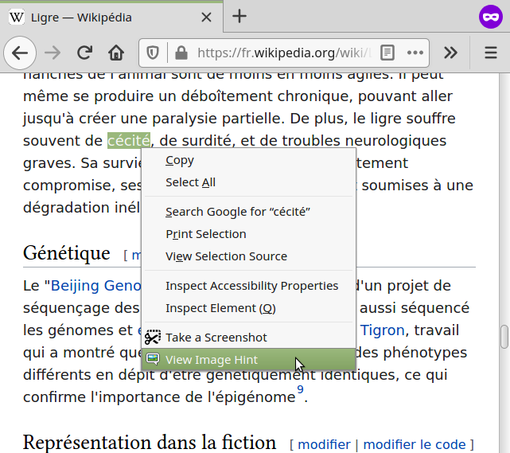
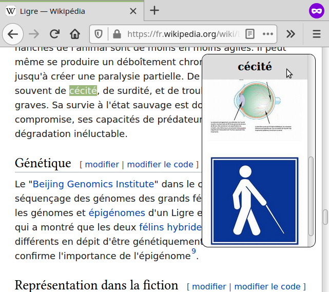

# ImageHint

A browser extension to help intermediate language learners read texts in
their target language.  Highlight a word or phrase that you're unfamiliar with
and right-click to view image search results (thus maintaining immersion,
unlike tools that provide a translation in your native language).

Of course, the results aren't always useful (especially when a word is
also the name of a major piece of media, similar to a common word in
a more widely-spoken language, or difficult to represent pictorally), but
it's helpful a lot of the time. 

## Usage

1. Highlight some text.
2. Right-click to open context menu.
3. Select the "ImageHint" button.
4. To dismiss the image hint results, click anywhere on the results list.

## Disclaimers

I (i.e. the developer of ImageHint) do not store, or even have access to, your
search data or any other data about you.  However, you should be aware that
ImageHint uses the Yahoo search engine, in a way that is
essentially identical to you navigating to the Yahoo image search page and
entering the search terms manually.  This means that Yahoo will be aware
of your searches, and their use of this data will be governed by their own
privacy policy.

ImageHint is not responsible for the images returned, which may
contain objectionable content.  The search results are influenced by your
Yahoo search settings; in particular, if you've turned Safesearch off when
using Yahoo manually, ImageHint will also not use Safesearch.

## License

ImageHint is released under the MIT license, as described in `LICENSE.txt`
